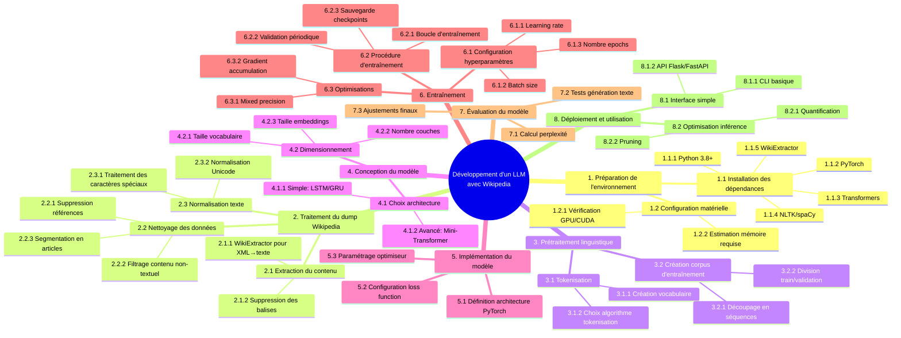

```mermaid
mindmap
  root((Développement d'un LLM
        avec Wikipedia))
    1. Préparation de l'environnement
        1.1 Installation des dépendances
            1.1.1 Python 3.8+
            1.1.2 PyTorch
            1.1.3 Transformers
            1.1.4 NLTK/spaCy
            1.1.5 WikiExtractor
        1.2 Configuration matérielle
            1.2.1 Vérification GPU/CUDA
            1.2.2 Estimation mémoire requise
    2. Traitement du dump Wikipedia
        2.1 Extraction du contenu
            2.1.1 WikiExtractor pour XML→texte
            2.1.2 Suppression des balises
        2.2 Nettoyage des données
            2.2.1 Suppression références
            2.2.2 Filtrage contenu non-textuel
            2.2.3 Segmentation en articles
        2.3 Normalisation texte
            2.3.1 Traitement des caractères spéciaux
            2.3.2 Normalisation Unicode
    3. Prétraitement linguistique
        3.1 Tokenisation
            3.1.1 Création vocabulaire
            3.1.2 Choix algorithme tokenisation
        3.2 Création corpus d'entraînement
            3.2.1 Découpage en séquences
            3.2.2 Division train/validation
    4. Conception du modèle
        4.1 Choix architecture
            4.1.1 Simple: LSTM/GRU
            4.1.2 Avancé: Mini-Transformer
        4.2 Dimensionnement
            4.2.1 Taille vocabulaire
            4.2.2 Nombre couches
            4.2.3 Taille embeddings
    5. Implémentation du modèle
        5.1 Définition architecture PyTorch
        5.2 Configuration loss function
        5.3 Paramétrage optimiseur
    6. Entraînement
        6.1 Configuration hyperparamètres
            6.1.1 Learning rate
            6.1.2 Batch size
            6.1.3 Nombre epochs
        6.2 Procédure d'entraînement
            6.2.1 Boucle d'entraînement
            6.2.2 Validation périodique
            6.2.3 Sauvegarde checkpoints
        6.3 Optimisations
            6.3.1 Mixed precision
            6.3.2 Gradient accumulation
    7. Évaluation du modèle
        7.1 Calcul perplexité
        7.2 Tests génération texte
        7.3 Ajustements finaux
    8. Déploiement et utilisation
        8.1 Interface simple
            8.1.1 CLI basique
            8.1.2 API Flask/FastAPI
        8.2 Optimisation inférence
            8.2.1 Quantification
            8.2.2 Pruning
```